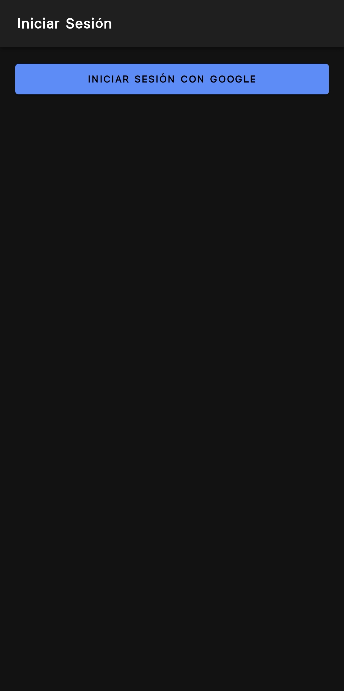
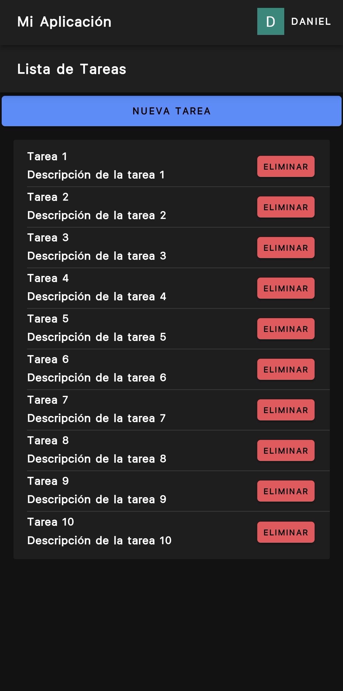
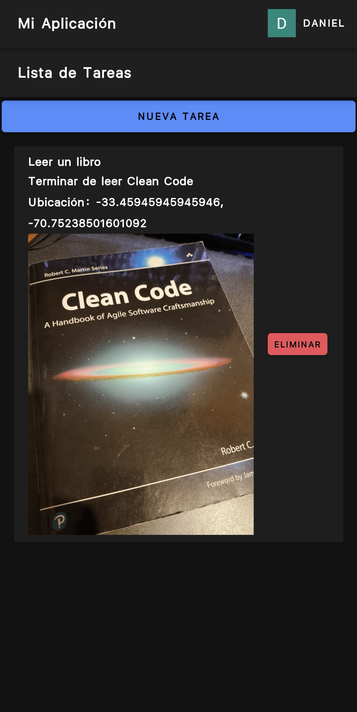

| Vista de Inicio de Sesión                                | Vista de la Lista de Tareas                                       |
|----------------------------------------------------------|-------------------------------------------------------------------|
|  |  |
| Crear Nueva Tarea                                        | Tarea con Metadatos (Imagen y Ubicación)                          |
|  |  |

# Checklist de Implementación

## Funcionalidades básicas
- [x] Crear una aplicación móvil básica con Ionic que permita registrar y visualizar una lista de tareas pendientes (To-Do List).

## Interacción con periféricos
- [x] Implementar funcionalidad para capturar imágenes utilizando la cámara del dispositivo y adjuntarlas a las tareas.
- [x] Integrar GPS para registrar la ubicación donde se crea cada tarea.

## Integración con servicios web y APIs
- [ ] Implementar la sincronización de tareas con un servicio web o API externa para almacenarlas de forma remota.
- [ ] Permitir la importación de tareas desde una API externa para completar la lista de tareas.

## Pruebas de funcionalidad
- [ ] Incluir pruebas automatizadas para verificar la funcionalidad de captura de imágenes.
- [ ] Incluir pruebas automatizadas para verificar la funcionalidad de obtención de ubicación.

## Almacenamiento local avanzado
- [x] Implementar almacenamiento local utilizando Capacitor para guardar las tareas en el dispositivo incluso sin conexión a internet.

## Autenticación de usuarios
- [x] Integrar un sistema básico de autenticación de usuarios para proteger las tareas y permitir múltiples usuarios.

## Comunicación con APIs externas
- [ ] Ampliar la integración con APIs externas para:
  - [ ] Sincronización en tiempo real de las tareas.
  - [ ] Obtención de datos adicionales para cada tarea.

## Otros
- [x] Configurar el proyecto con el framework frontend elegido (Angular, React o Vue).
- [x] Utilizar plugins de Capacitor para acceso a cámara y geolocalización.
